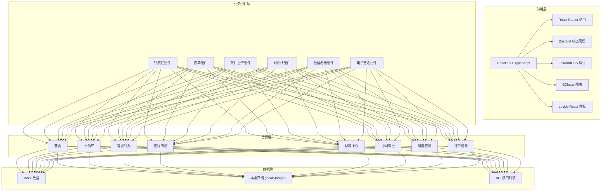

## 1. 架构设计



## 2. 技术描述

- **前端框架**: React 18 + TypeScript
- **构建工具**: Vite 5
- **路由管理**: React Router DOM 6
- **状态管理**: Zustand 4
- **样式方案**: TailwindCSS 3
- **图表库**: ECharts 5
- **图标库**: Lucide React
- **后端**: 无后端，使用 Mock 数据模拟
- **数据持久化**: localStorage 存储用户信息、办件数据

## 3. 路由定义

| 路由 | 页面 | 说明 |
|------|------|------|
| / | 首页 | 平台入口，展示热门事项和快捷功能 |
| /items | 事项库 | 事项分类浏览和搜索 |
| /items/:id | 事项详情 | 单个事项的详细信息 |
| /guide | 智能导办 | 办理条件自测和流程引导 |
| /apply/:itemId | 在线申报 | 表单填写、材料上传、电子签名 |
| /materials | 材料中心 | 我的材料、证照调用、材料补正 |
| /approval | 协同审批 | 待办列表、审批处理、部门分派 |
| /progress | 进度查询 | 办件列表、办件详情、预约取件 |
| /statistics | 评价统计 | 满意度评价、办件量看板 |
| /login | 登录页 | 用户登录、身份核验 |

## 4. 数据模型

### 4.1 核心数据类型

```typescript
// 用户信息
interface User {
  id: string;
  name: string;
  idCard: string;
  phone: string;
  role: 'citizen' | 'worker' | 'approver' | 'admin';
  avatar?: string;
}

// 事项信息
interface ServiceItem {
  id: string;
  name: string;
  category: string;
  department: string;
  promiseTime: number;
  description: string;
  conditions: string[];
  materials: MaterialItem[];
  process: ProcessStep[];
  fee: string;
}

// 材料项
interface MaterialItem {
  id: string;
  name: string;
  required: boolean;
  format: string[];
  maxSize: number;
  description: string;
}

// 办件信息
interface Application {
  id: string;
  itemId: string;
  itemName: string;
  applicantId: string;
  applicantName: string;
  status: 'draft' | 'submitted' | 'processing' | 'correction' | 'approved' | 'rejected' | 'completed';
  formData: Record<string, any>;
  materials: UploadedMaterial[];
  createTime: string;
  updateTime: string;
  currentNode: string;
  approvalRecords: ApprovalRecord[];
}

// 已上传材料
interface UploadedMaterial {
  id: string;
  materialId: string;
  name: string;
  url: string;
  size: number;
  uploadTime: string;
  status: 'pending' | 'approved' | 'rejected';
}

// 审批记录
interface ApprovalRecord {
  id: string;
  nodeName: string;
  department: string;
  handler: string;
  opinion: string;
  status: 'pending' | 'approved' | 'rejected' | 'correction';
  time: string;
}

// 评价信息
interface Evaluation {
  id: string;
  applicationId: string;
  rating: number;
  content: string;
  createTime: string;
}
```

### 4.2 状态管理 (Zustand Store)

```typescript
// 用户状态
interface UserStore {
  user: User | null;
  isLoggedIn: boolean;
  login: (phone: string, password: string) => Promise<boolean>;
  logout: () => void;
}

// 办件状态
interface ApplicationStore {
  applications: Application[];
  currentApplication: Application | null;
  fetchApplications: () => void;
  createApplication: (itemId: string) => Application;
  updateApplication: (id: string, data: Partial<Application>) => void;
  submitApplication: (id: string) => void;
}

// 事项状态
interface ItemStore {
  items: ServiceItem[];
  currentItem: ServiceItem | null;
  fetchItems: (filters?: any) => void;
  fetchItemDetail: (id: string) => ServiceItem | undefined;
}
```

## 5. 项目目录结构

```
src/
├── assets/              # 静态资源
│   ├── images/
│   └── fonts/
├── components/          # 公共组件
│   ├── Layout/          # 布局组件
│   ├── Form/            # 表单组件
│   ├── Upload/          # 上传组件
│   ├── Timeline/        # 时间线组件
│   ├── Signature/       # 电子签名组件
│   └── common/          # 通用组件 (Button, Card, Modal...)
├── pages/               # 页面组件
│   ├── Home/
│   ├── Items/
│   ├── Guide/
│   ├── Apply/
│   ├── Materials/
│   ├── Approval/
│   ├── Progress/
│   ├── Statistics/
│   └── Login/
├── store/               # 状态管理
│   ├── useUserStore.ts
│   ├── useApplicationStore.ts
│   └── useItemStore.ts
├── mock/                # Mock 数据
│   ├── items.ts
│   ├── applications.ts
│   └── users.ts
├── utils/               # 工具函数
│   ├── request.ts
│   ├── storage.ts
│   └── validate.ts
├── types/               # 类型定义
│   └── index.ts
├── App.tsx
├── main.tsx
└── index.css
```

## 6. 关键技术实现

### 6.1 多步骤表单
- 使用 React state 管理表单步骤
- 每步数据自动保存到 localStorage
- 支持步骤间自由跳转
- 表单数据校验使用 Zod 或自定义校验函数

### 6.2 文件上传
- 支持拖拽上传和点击选择
- 文件格式和大小校验
- 上传进度显示
- 图片预览功能
- 分片上传（大文件）

### 6.3 电子签名
- Canvas 实现手写签名
- 支持触摸设备
- 签名图片生成和导出
- 签名验证

### 6.4 数据看板
- ECharts 实现各类图表（柱状图、折线图、饼图）
- 数据实时更新
- 图表响应式适配
- 支持图表导出

### 6.5 权限控制
- 路由级权限守卫
- 组件级权限控制
- 基于角色的功能可见性控制
