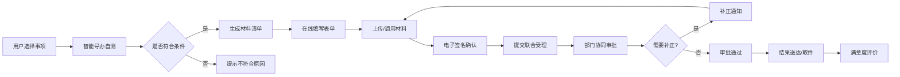

## 1. 产品概述
政务服务"一件事"联办平台，为市民和政务大厅窗口提供开店、入学、退休等组合事项的一站式办理服务。通过整合多部门事项、优化办理流程、智能引导申报，实现"一件事一次办"，提升政务服务效率和群众满意度。

## 2. 核心功能

### 2.1 用户角色
| 角色 | 注册方式 | 核心权限 |
|------|----------|----------|
| 市民用户 | 手机号/身份证注册 | 事项查询、在线申报、进度查询、评价反馈 |
| 窗口工作人员 | 工号登录 | 事项受理、材料审核、联合审批、补正通知 |
| 部门审批员 | 部门账号登录 | 部门分派、证照调用、审批决定、超时预警处理 |
| 系统管理员 | 管理员账号 | 用户管理、事项配置、数据统计、看板管理 |

### 2.2 功能模块
1. **首页**: 导航栏、搜索框、热门事项、办事指南、通知公告、快捷入口
2. **事项库**: 事项分类、事项搜索、事项详情、办理条件、材料清单
3. **智能导办**: 办理条件自测、场景选择、流程引导、表单预填建议
4. **在线申报**: 表单填写、材料上传、电子签名、联合受理、提交申报
5. **材料中心**: 材料列表、材料上传、证照调用、材料补正、材料复用
6. **协同审批**: 部门分派、审批流转、补正通知、超时预警、审批记录
7. **进度查询**: 办件列表、办件详情、办理节点、预约取件、结果下载
8. **评价统计**: 满意度评价、办件量看板、超时统计、部门效率分析

### 2.3 页面详情
| 页面名称 | 模块名称 | 功能描述 |
|----------|----------|----------|
| 首页 | 导航区 | 顶部导航、用户登录入口、消息通知 |
| 首页 | 搜索区 | 全局搜索、热门事项标签、语音搜索入口 |
| 首页 | 热门事项 | 开店一件事、入学一件事、退休一件事等卡片展示 |
| 首页 | 办事指南 | 办理流程说明、常见问题、政策法规 |
| 首页 | 通知公告 | 最新政策、系统通知、办件提醒 |
| 事项库 | 分类导航 | 个人办事、法人办事、一件事主题分类 |
| 事项库 | 搜索筛选 | 关键词搜索、部门筛选、办理时限筛选 |
| 事项库 | 事项列表 | 事项卡片、办理机构、承诺时限、在线办理按钮 |
| 事项库 | 事项详情 | 办理条件、申请材料、办理流程、收费标准、咨询方式 |
| 智能导办 | 场景选择 | 选择办理场景、填写基本信息 |
| 智能导办 | 条件自测 | 办理条件问卷、资格预评估、结果提示 |
| 智能导办 | 流程引导 | 步骤导航、表单预填、材料清单生成 |
| 在线申报 | 表单填写 | 多步骤表单、自动保存、表单校验 |
| 在线申报 | 材料上传 | 拖拽上传、格式校验、大小限制、预览功能 |
| 在线申报 | 电子签名 | 签名板、手写签名、电子印章 |
| 在线申报 | 提交确认 | 信息预览、声明勾选、提交申报 |
| 材料中心 | 我的材料 | 材料分类、材料列表、材料详情、材料管理 |
| 材料中心 | 证照调用 | 电子证照库、证照授权、证照复用 |
| 材料中心 | 材料补正 | 补正通知、补正材料上传、补正提交 |
| 协同审批 | 待办列表 | 待办件、在办件、已办件 |
| 协同审批 | 审批详情 | 办件信息、材料查看、审批意见 |
| 协同审批 | 部门分派 | 部门选择、分派说明、时限设置 |
| 协同审批 | 超时预警 | 超时提醒、预警列表、督办功能 |
| 进度查询 | 办件列表 | 我的办件、筛选查询、办件状态 |
| 进度查询 | 办件详情 | 办理节点、时间线、审批记录 |
| 进度查询 | 预约取件 | 取件方式选择、时间预约、取件码生成 |
| 进度查询 | 结果下载 | 办理结果、证照下载、批文下载 |
| 评价统计 | 满意度评价 | 星级评价、评价内容、评价提交 |
| 评价统计 | 办件量看板 | 办件统计图表、部门排名、趋势分析 |
| 评价统计 | 数据报表 | 超时统计、满意率统计、导出报表 |

## 3. 核心流程

用户选择"一件事"主题 → 智能导办条件自测 → 生成个性化材料清单 → 在线填写申报表单 → 上传材料/调用电子证照 → 电子签名确认 → 提交联合受理 → 部门协同审批 → 补正通知/审批通过 → 结果送达/预约取件 → 满意度评价

## 4. 用户界面设计

### 4.1 设计风格
- **主色调**: 政务蓝 (#165DFF)，代表权威、专业、可信赖
- **辅助色**: 成功绿 (#00B42A)、警告橙 (#FF7D00)、错误红 (#F53F3F)、信息灰 (#86909C)
- **中性色**: 白色 #FFFFFF、浅灰 #F2F3F5、中灰 #C9CDD4、深灰 #4E5969、黑色 #1D2129
- **按钮风格**: 圆角矩形 (8px)，主按钮蓝色填充，次要按钮白色边框
- **字体**: "Noto Sans SC" 中文无衬线字体，标题字重 600，正文 400
- **布局风格**: 卡片式布局，顶部固定导航，左侧分类菜单，内容区域自适应
- **图标风格**: Lucide 线性图标，保持统一的线条粗细和视觉风格

### 4.2 页面设计概述
| 页面名称 | 模块名称 | UI 元素 |
|----------|----------|---------|
| 首页 | Hero 区域 | 大标题、搜索框、渐变背景、微妙动画 |
| 首页 | 事项卡片 | 悬停阴影、图标动画、渐变边框 |
| 事项库 | 筛选栏 | 标签切换、下拉选择、搜索联想 |
| 事项库 | 列表项 | 双列布局、状态标签、快速操作按钮 |
| 智能导办 | 步骤条 | 数字步骤、连接线、完成状态动画 |
| 智能导办 | 问卷卡片 | 单选/多选组件、进度指示器 |
| 在线申报 | 表单项 | 输入框、选择器、日期控件、校验提示 |
| 在线申报 | 上传区域 | 拖拽区、文件列表、进度条、预览缩略图 |
| 协同审批 | 时间线 | 节点图标、连接线、状态颜色区分 |
| 评价统计 | 数据看板 | ECharts 图表、卡片指标、渐变背景 |

### 4.3 响应式
- 桌面端优先 (1440px+)，适配平板 (768px-1440px) 和移动端 (375px-768px)
- 导航栏在移动端转为汉堡菜单
- 表格在移动端转为卡片列表展示
- 表单字段在移动端全宽显示
- 触控区域最小 44px × 44px

### 4.4 动效设计
- 页面切换使用淡入淡出过渡 (300ms ease)
- 卡片悬停时有轻微上浮和阴影增强效果
- 按钮点击有缩放反馈 (scale: 0.98)
- 表单校验错误有抖动提示
- 数据加载使用骨架屏和脉冲动画
- 步骤完成有打勾动画效果
